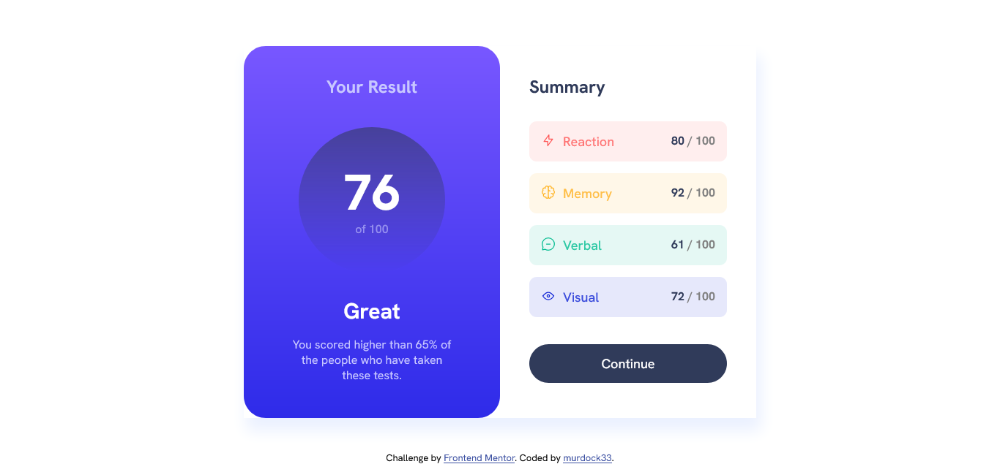

# Frontend Mentor - Results summary component solution

This is a solution to the [Results summary component challenge on Frontend Mentor](https://www.frontendmentor.io/challenges/results-summary-component-CE_K6s0maV). Frontend Mentor challenges help you improve your coding skills by building realistic projects.

## Table of contents

- [Overview](#overview)
  - [The challenge](#the-challenge)
  - [Screenshot](#screenshot)
  - [Links](#links)
- [My process](#my-process)
  - [Built with](#built-with)
  - [What I learned](#what-i-learned)
- [Author](#author)

## Overview

### The challenge

Users should be able to:

- View the optimal layout for the interface depending on their device's screen size
- See hover and focus states for all interactive elements on the page
- **Bonus**: Use the local JSON data to dynamically populate the content

### Screenshot



### Links

- Solution URL: [solution URL](https://www.frontendmentor.io/solutions/results-summary-component-using-json-file-to-render-the-content-trUaXkvC7k)
- Live Site URL: [live site URL](https://murdock33.github.io/frontend-mentor-project/HTML%20&%20CSS/results-summary-component-main/)

## My process

### Built with

- Semantic HTML5 markup
- Flexbox
- JavaScript
- Github Raw Content

### What I learned

During this project, I focused on learning how to retrieve JSON data and dynamically render it using JavaScript. However, I faced a challenge when trying to directly access the JSON file hosted on GitHub Pages, as it's designed for static content. To work around this limitation, I implemented a solution by fetching the JSON data using GitHub's raw content API. This allowed me to successfully retrieve and process the data within my JavaScript application.

```js
fetch(
  "https://raw.githubusercontent.com/murdock33/frontend-mentor-project/main/HTML%20%26%20CSS/results-summary-component-main/data.json"
)
  .then((response) => response.json())
  .then((data) => {
    const sumGroup = document.querySelector(".summary-group");

    data.forEach((item) => {
      const article = document.createElement("article");

      fetch(item.icon)
        .then((response) => response.text())
        .then((svgContent) => {
          article.innerHTML = `
            <div>
              ${svgContent}
              <p class="${item.category.toLowerCase()}">${item.category}</p>
            </div>
            <p class="score">
                ${item.score} <span style="color: gray;"> / 100 </span> 
            </p>
          `;
        });

      article.classList.add(`${item.category}-article`.toLowerCase());
      sumGroup.appendChild(article);
    });
  });
```

## Author

- Frontend Mentor - [@yourusername](https://www.frontendmentor.io/profile/murdock33)
